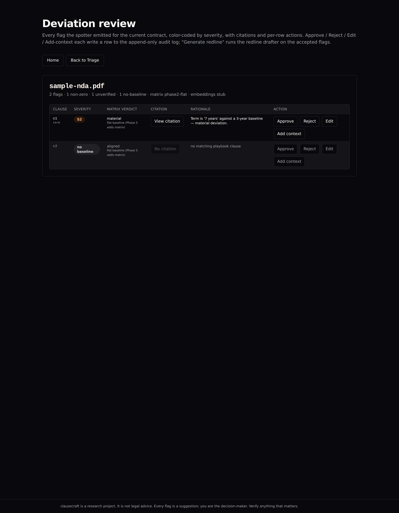
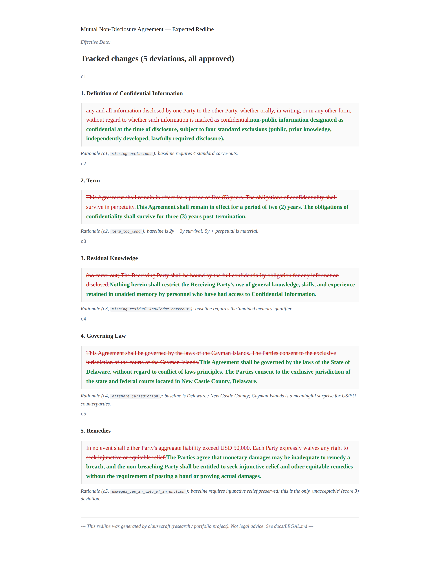

# clausecraft

> Upload a contract, get a deviation table against a public-source playbook, approve the redlines you want, download a tracked-changes .docx. Every flag is cited. Nothing is trusted by default.

A multi-agent pipeline — **ingest → classify → deviation-spot → redline → human-review → output** — that takes a privacy or commercial contract in **English or German**, parses it into clauses, scores each clause 0–3 against a public-source baseline playbook (EU SCCs, IAPP, BGB, ABA, DSGVO, Tarifvertrag), and produces a tracked-changes `.docx` with a deviation table and a plain-language summary memo. Three contract types are in scope: **NDA, DPA, Employment**. Every deviation cites the specific playbook clause AND the contract text it was compared against; flags without citations are marked **unverified**. A four-axis counterparty matrix encodes when a deviation is acceptable vs material — e.g. *"1y limitation of liability → acceptable for SaaS, material for healthcare vendor."* Every decision is logged to an immutable Postgres audit table and traced through Langfuse.



> *Spellbook costs $30k/year. This costs an LLM API key. The playbook is public. The redlines are reproducible. Read the eval set before you call it a toy.*

**This is a research / portfolio project, not a product. It is not legal advice.** See [`docs/LEGAL.md`](./docs/LEGAL.md) for the full disclaimer.

---

## Quickstart

```bash
git clone https://github.com/anuragparida/clausecraft.git
cd clausecraft
cp .env.example .env                       # no real secrets in the stub
docker compose up --build                  # postgres + backend + frontend + langfuse
# wait ~30s for first-boot, then verify:
curl -s -w 'frontend=%{http_code}\n' -o /dev/null http://localhost:15173/
curl -s -w 'backend=%{http_code}\n'  -o /dev/null http://localhost:18000/healthz
# open http://localhost:15173/ → click "Triage contracts" → upload a PDF
```

| Service     | URL                          | What it is                                  |
|-------------|------------------------------|---------------------------------------------|
| Frontend    | http://localhost:15173       | Vite + React UI (triage, review, audit)     |
| Backend     | http://localhost:18000       | FastAPI (`/healthz`, `/contracts/*`)         |
| Langfuse    | http://localhost:13000       | LLM observability (every call traced)       |
| Postgres    | `localhost:15432`            | pgvector-enabled DB (audit log + vectors)   |

Ports are high-numbered (12000+) on purpose: this host already binds 3000/5432/8000/9874/9875 for other projects. See [`docs/08-tech-stack.md`](./docs/08-tech-stack.md) for the full rationale.

### Try the demo contract

A known-bad NDA with 5 hand-crafted deviations lives in [`demo/known-bad-nda.pdf`](./demo/known-bad-nda.pdf), with the expected redline in [`demo/expected-redline.docx`](./demo/expected-redline.docx). Upload `known-bad-nda.pdf` to the running stack and compare the system's output to the expected redline — the deviations match by design.

---

## What this isn't

clausecraft is a triage tool and a tracked-changes redline generator. It is **not**:

- **Not legal advice.** A deviation table is a checklist of things to look at, not a verdict. A real lawyer reviews the contract that matters. The full disclaimer — what the system is appropriate for, what it isn't, and the F1 numbers that bound the claims — is in [`docs/LEGAL.md`](./docs/LEGAL.md).
- **Not a regulated SaaS.** No SOC 2, no multi-tenant auth, no billing. Single operator, single host.
- **Not jurisdiction-specific.** The playbook is anchored to public sources (EU SCCs, IAPP, ABA, BGB, DSGVO) but the counterparty matrix is *our judgment* about what's acceptable for an SMB vs an enterprise — different lawyers will disagree. The matrix is configurable per `playbook/counterparty_matrix.yaml`.
- **Not a substitute for human review.** The HITL step is the product's thesis. Every redline comes from a decision a human made on a flagged clause.
- **Not real-time.** The deviation spotter is a multi-agent LLM pass per clause; expect tens of seconds for a typical NDA, more for a 30-page DPA.

See the *Eval* section below for the F1 numbers, and [`docs/09-threat-model.md`](./docs/09-threat-model.md) for the model failure modes we don't claim to handle.

---

## Threat model (1 paragraph)

The system is exposed to five non-obvious failure modes: **model poisoning** in the contract text (prompt injection hidden in clause language), **eval-set overfitting** (a tighter eval set ⇒ a more brittle claim), **jurisdiction drift** (a US-style contract analyzed against EU baselines produces noise), **counterparty matrix opinion-as-config** (the matrix is a claim about acceptability, not a legal standard), and **confident LLM hallucinations** mitigated only by the cite-or-mark-unverified rule. The append-only audit log answers "what happened" but does not stop a determined operator with shell on the box. The full threat model — including the IP-safety rules, the "no HDI-internal data" rule, and the eval-set discipline — is in [`docs/09-threat-model.md`](./docs/09-threat-model.md).

---

## How the eval works

The eval harness is the spec's core claim, not a footnote. **F1 here is a deviation-set match**: precision is `flagged-but-not-expected / all-flagged`, recall is `expected-but-not-flagged / all-expected`. The harness also reports classification F1, retrieval F1, severity-mismatch count, and citation completeness — see [`docs/07-eval-strategy.md`](./docs/07-eval-strategy.md) for the rubric philosophy and [`docs/EVAL_RESULTS.md`](./docs/EVAL_RESULTS.md) for the 5-minute read.

**Per-type × per-language F1 (latest leaderboard row, 25 contracts):**

| Type       | Lang | n  | Deviation F1 | Classification F1 | Citation completeness | Status      |
|------------|------|----|--------------|-------------------|-----------------------|-------------|
| NDA        | EN   | 10 | 1.00         | 0.70              | 1.00                  | full        |
| NDA        | DE   | 5  | 1.00         | 0.05              | 1.00                  | full*       |
| DPA        | EN   | 5  | 1.00         | 0.83              | 1.00                  | full        |
| DPA        | DE   | 5  | 1.00         | 1.00              | 1.00                  | full        |
| Employment | EN   | 0  | —            | —                 | —                     | matrix-only |
| Employment | DE   | 0  | —            | —                 | —                     | matrix-only |

*\* **NDA-DE classification F1 = 0.05 is reported as-is.** The rule-based DE classifier in Phase 4 confuses German label sets on § 2 GeschGehG clauses; the LLM-driven classifier is a follow-up card. The product metric (deviation F1 = 1.00) is unaffected. The current matrix-aware spotter runs in deterministic mode against the eval set (the harness mocks the LLM; no real key in the demo). The full per-type story is in [`docs/EVAL_RESULTS.md`](./docs/EVAL_RESULTS.md).*

The eval is reproducible:

```bash
cd backend && uv sync --frozen              # one-time (Python 3.12, FastAPI deps)
cd .. && pytest evals/                      # ~1s on the 25-contract set (cache-warm)
cat evals/runs/$(ls -t evals/runs/ | head -1)   # the per-contract report
```

The harness is content-addressed cached (PDF text, embeddings, golden YAMLs, mock LLM responses), so re-runs are sub-second once the cache is warm. Leaderboard rows append to [`evals/leaderboard.csv`](./evals/leaderboard.csv) on every run. The Phase 2 exit gate (per `docs/11-phases.md` § Phase 2) is `citation_completeness ≥ 95%`; the Phase 4 DE-vs-EN gap assertions are `gap_deviation_f1 ≤ 10%` and `gap_citation_completeness ≤ 5%` — both are code assertions, not docs.

---

## Audit trail

Every approval, rejection, severity override, context note, redline generation, and redline download is logged to an append-only Postgres table. A trigger rejects `UPDATE` and `DELETE` at the database level — rows can be inserted but not edited or removed. The schema is `(contract_id, clause_id, decision_type, payload_json, decided_by, decided_at)`; `decided_at` is server-set, not caller-supplied. The full decision chain for a contract renders on the **AuditReplay** page (read-only timeline), and exports as JSON for re-import or PDF for handing to a prospect's legal team — filenames `audit-{contract_id}.json` and `audit-{contract_id}.pdf`. Every LLM call is traced in Langfuse (dev: port 13000) so the "why was this flagged" question is answerable from either side of the human/agent boundary. The HITL step is the product's thesis: the system proposes, the human disposes. See [`docs/09-threat-model.md`](./docs/09-threat-model.md) for why this isn't a checkbox.

---

## Supported contract types

Phase 6 ships the v1 3×2 grid: NDA × DPA × Employment, in EN and DE. Each cell below is honest about the current eval-set coverage and the public-source baseline count.

| Type       | EN                                                                                          | DE                                                                                          |
|------------|---------------------------------------------------------------------------------------------|---------------------------------------------------------------------------------------------|
| NDA        | ✅ **full** — 10 eval contracts, 5 baselines, dev F1 = 1.00 (EU SCCs, IAPP, ABA, IAPP NDA template); *SOURCES.md gap: NDA-EN baselines predate the SOURCES.md convention — see commit `07a3d75` and per-baseline YAML `source:` fields* | ✅ **full** — 5 eval contracts, 5 baselines, dev F1 = 1.00 (BMJ, DIHK, IHK-München, IHK-Hessen, WKO FEEI); sources in [`playbook/baselines/nda-de/SOURCES.md`](./playbook/baselines/nda-de/SOURCES.md) |
| DPA        | ✅ **matrix-aware** — 5 eval contracts, 5 baselines, dev F1 = 1.00 ([GDPR Art. 28](https://gdpr-info.eu/art-28-gdpr/), [EDPB Guidelines 07/2020](https://www.edpb.europa.eu/our-work-tools/our-documents/guidelines/guidelines-072020-concepts-controller-and-processor-gdpr_en), [EU SCCs 2021/914](https://eur-lex.europa.eu/eli/dec_impl/2021/914/oj), [Art. 33 GDPR](https://gdpr-info.eu/art-33-gdpr/), [DSK Kurzpapier Nr. 13](https://www.datenschutzkonferenz-online.de)); sources in [`playbook/baselines/dpa-en/SOURCES.md`](./playbook/baselines/dpa-en/SOURCES.md) | ✅ **matrix-aware** — 5 eval contracts, 6 baselines, dev F1 = 1.00 (Art. 28 DSGVO, EDPB-DE 07/2020, EU SCCs-DE 2021/914, Art. 33 DSGVO, DSK Kurzpapier Nr. 13, [§ 62 Abs. 4 BDSG 2018](https://www.gesetze-im-internet.de/bdsg_2018/__62.html)); sources in [`playbook/baselines/dpa-de/SOURCES.md`](./playbook/baselines/dpa-de/SOURCES.md) |
| Employment | 🚧 **matrix-only** — 0 eval contracts in the harness, 5 baselines (notice period, non-solicitation, leave entitlements, remuneration, termination for cause); sources in [`playbook/baselines/employment-en/SOURCES.md`](./playbook/baselines/employment-en/SOURCES.md) | 🚧 **matrix-only** — 0 eval contracts in the harness, 5 baselines (same set, BGB/KSchG-anchored); sources in [`playbook/baselines/employment-de/SOURCES.md`](./playbook/baselines/employment-de/SOURCES.md) |

**Status legend.** **full** — pipeline runs end-to-end, deviation F1 = 1.00 on the eval set. **matrix-aware** — the matrix-aware spotter is wired and the v1 eval set runs green; the matrix only **narrows** verdicts, so on the enterprise-default eval set it changes 0 contracts (the matrix's effect shows up on `smb` / `public_sector` / `healthcare`). **matrix-only** — the matrix lookup is wired but the eval harness has not been run for this cell yet; the spotter falls through to the flat baseline. Future types (sale of goods, M&A, services) are out of scope for v1.

The counterparty matrix ([`playbook/counterparty_matrix.yaml`](./playbook/counterparty_matrix.yaml)) has four axes — `enterprise`, `smb`, `public_sector`, `healthcare` — and only **narrows** verdicts (never relaxes): a `material` flag in the flat baseline stays `material` for SMBs, becomes `unacceptable` for healthcare under HIPAA BAA. The matrix is configurable per-cell by editing the YAML; the spotter picks the change up on the next ingest. Per-cell `# source:` comments name the legal regime the verdict is anchored against.



---

## Deploy

The dev stack runs locally on a single host with `docker compose up`. Production deploy runbook (Hetzner / Fly.io — single-host Docker Compose + Caddy for TLS termination, env-template split, Langfuse stays self-hosted) lands in [`docs/DEPLOY.md`](./docs/DEPLOY.md) (Card 2 of Phase 6 — not yet shipped). **Public deploy is gated** on a lawyer-reviewed [`docs/LEGAL.md`](./docs/LEGAL.md) and on Anurag's confirmation that no HDI-internal data is in the repo.

---

## Layout

```
clausecraft/
├── backend/                  # FastAPI + SQLAlchemy + LangGraph (uv, Python 3.12)
├── frontend/                 # Vite + TS + React + Tailwind + shadcn dark mode (pnpm)
├── playbook/                 # public-source baselines + counterparty matrix
├── examples/                 # eval contracts (10 NDA EN + 5 NDA DE + 10 DPA + 10 Employment) + golden YAMLs
├── evals/                    # pytest harness + leaderboard.csv + per-run reports
├── docs/                     # 12 spec docs (overview, features, eval strategy, threat model, EVAL_RESULTS, LEGAL, PLAYBOOK, ...)
├── demo/                     # counterfactual known-bad NDA + expected redline
├── docker-compose.yml        # single-host dev stack
├── LICENSE                   # Apache 2.0
└── docs/LEGAL.md             # the canonical "not legal advice" language
```

---

## License

Apache 2.0 — see [`LICENSE`](./LICENSE). Contributions welcome.

| If you want to… | Read |
|---|---|
| Understand the legal disclaimer | [`docs/LEGAL.md`](./docs/LEGAL.md) |
| Read the F1 numbers and the eval report | [`docs/EVAL_RESULTS.md`](./docs/EVAL_RESULTS.md) |
| Know what the system could be attacked with | [`docs/09-threat-model.md`](./docs/09-threat-model.md) |
| Add a new contract type or baseline source | [`docs/PLAYBOOK.md`](./docs/PLAYBOOK.md) |
| See the audit-log UX in the UI | the **AuditReplay** page in the running frontend |
| Watch the 2-minute walk-through | `demo/asciinema.cast` (Card 8 of Phase 6 — not yet shipped) |
